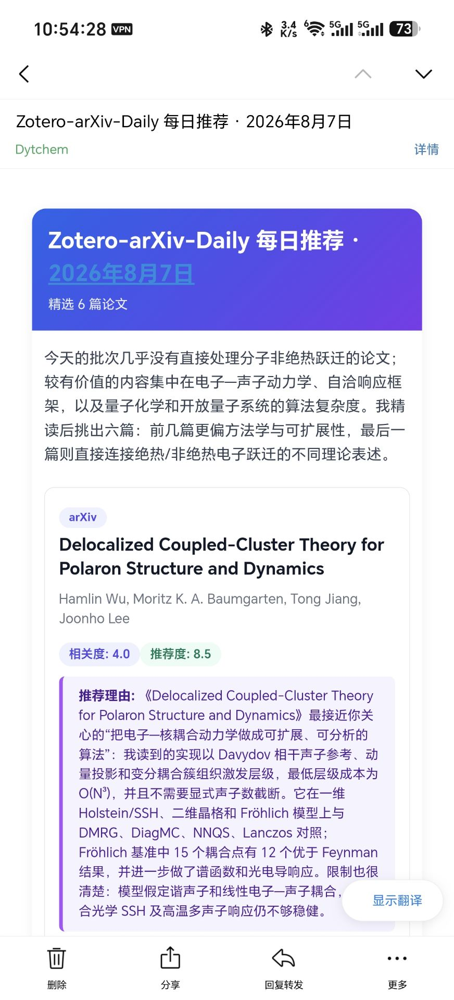
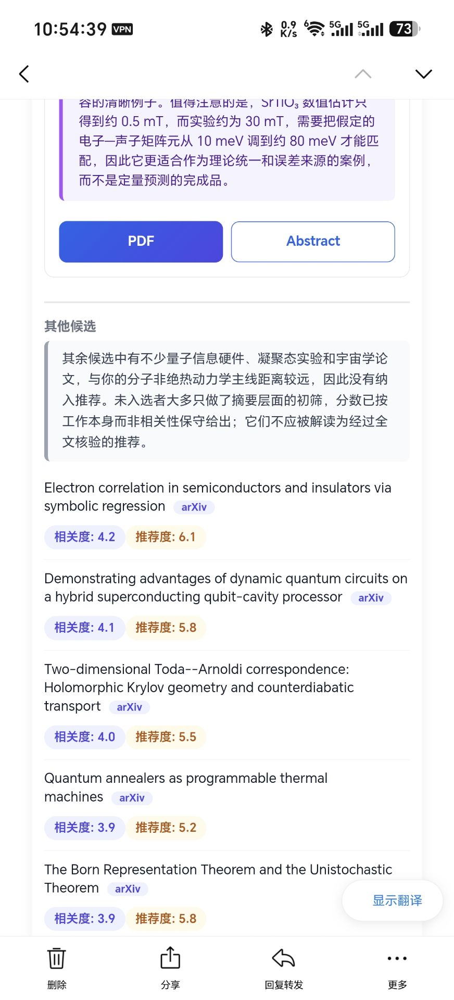
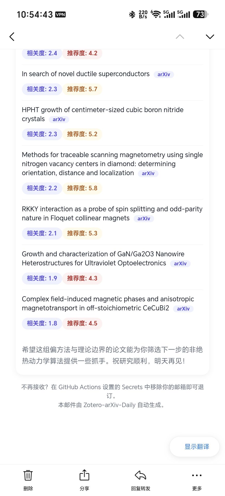

<p align="center">
  
</p>

<h1 align="center">Zotero-arXiv-Daily</h1>

<p align="center">
  <em>你的 AI 学术管家 —— 读你的 Zotero 文献库，每天扫描 arXiv/bioRxiv/medRxiv，用真正的编辑判断力发一封论文摘要邮件。</em>
</p>

<p align="center">
  <a href="https://github.com/Dytchem/zotero-arxiv-daily/actions/workflows/ci.yml"></a>
  
  
  
</p>

<p align="center"><a href="README.md">English</a></p>

---

## 它做什么

每天早上，一个 GitHub Actions 工作流（免费，不需要你自己的服务器）：

1. **学习你的口味** —— 从你的 Zotero 文献库提炼主题、方法，以及你真正阅读的*质量标准*。
2. **抓取最新论文** —— 来自 arXiv、bioRxiv 和 medRxiv。
3. **快速初筛** —— 用确定性的数学方法（向量嵌入 + BM25 + 时效加权）。
4. **让自主 agent 做决定** —— 它浏览当天*全部*论文（不只是初筛名单），自己抓全文精读（长文派子 agent 一次性读完全文）、上网核实出处、给每篇论文打**推荐度**（0–10）。
5. **发一封精美的 HTML 邮件**：导语、专家排序的卡片（带 **Relevance** 相关度徽章和 **推荐度** 徽章），以及完整的"其他候选"区 —— 每个候选都打了分，不静默丢弃任何一篇，**agent 真正读过并写了点评的论文排在最前面**。

**数学负责排序，agent 负责判断。** 嵌入分数只是提示，不是结论。

## 核心特性

- **Pi agent 引擎**（`agent/run.mjs` + `agent/ROLE.md`）—— 一个真正的编码 agent，自带工具：`inspect_candidates`、`inspect_pool`、`fetch_full_text`、`inspect_paper`（分页）、`summarize_paper`（长文子 agent）、`search_web`、`search_candidates`、`compare_papers`、`finish_reading`、`submit_digest`。它自己决定读什么、自己抓全文精读，每一条推荐都基于实际内容。
- **全池可见** —— agent 看到当天去重后的*全部*论文，包括被关键词/最低分/数量上限过滤器丢掉的。被启发式漏掉的高价值论文可以被救回、精读并推荐，邮件里带 "pool" 标注。
- **推荐度评分** —— 每个候选（选中与否）都有**推荐度**徽章（0–10），评判严谨性、新颖性和来源可信度。水文/低质论文即使看似相关也会被点名。
- **可辩护的排序** —— 更强的推荐在前；读者可以对比徽章。
- **保证读全文** —— 阅读进度被追踪；一篇论文必须真正读过（而非扫标题）才能被推荐。长文交给子 agent，子 agent **一次性读完全文**（不再分块截断，跨章节关联不丢失）；已读论文在 agent 的候选/全池列表中置顶并标 `[READ]`（pool 索引保持稳定）。
- **成本可控** —— agent 先从摘要给全池打分，只对短名单（约 8 篇）精读；长文子 agent 一次性读完全文。单次运行费用远低于 $0.20。无硬限制 —— agent 觉得需要时可以读更多。
- **安全渲染** —— 所有文本字段 HTML 转义、LaTeX→Unicode、链接白名单。agent 只写 JSON，不碰标记语言。
- **Provider 安全** —— LLM provider 从 config 中硬编码的 base URL（`llm.api.base_url`，默认 `https://opencode.ai/zen/go/v1`）+ `LLM_API_KEY` secret 编程式创建，只暴露你配置的那一个模型；Pi 内置的 provider 目录（可能静默回退到未配置的模型）从不加载。
- **优雅降级** —— Pi 失败 → Python harness → 嵌入排序摘要。邮件永远发得出去。
- **双提供商解绑** —— LLM（`LLM_API_KEY` → `https://opencode.ai/zen/go/v1`）与 reranker（`RERANKER_API_KEY` → `https://openrouter.ai/api/v1`）使用**相互独立的 secret**，base URL 硬编码在 config 中；两者之间不共享任何 key。
- **无缝隙回溯、已发去重、多来源、多收件人、webhook 通知、中英双语。**

## 快速开始

1. **Fork** 本仓库。
2. **配置** —— 在仓库 **Secrets** 里设置（Actions → Settings → Secrets）：
   - `ZOTERO_ID`、`ZOTERO_KEY` —— 你的 Zotero 用户 ID 和 API key
   - `LLM_API_KEY` —— LLM API key（base URL 已硬编码在 config 中：`https://opencode.ai/zen/go/v1`）
   - `RERANKER_API_KEY` —— reranker/embedding API key（base URL 已硬编码在 config 中：`https://openrouter.ai/api/v1`）
   - `SENDER`、`RECEIVER`、`SENDER_PASSWORD` —— SMTP 邮箱凭据
   - *可选但建议：* `ANYSEARCH_API_KEY` —— 在 [AnySearch](https://anysearch.com/console/api-keys) 免费注册的 API key，供 `search_web` 工具使用。agent 用它核实论文出处（作者、机构、新颖性声明）。**不配置也能匿名使用，但 GitHub Actions 共享 runner IP 很容易被限流，搜索可能失败**，拖慢 agent；配置后享有 1000 次/天（20 QPS）。
   - 设置 **Variable** `CUSTOM_CONFIG` —— YAML 覆写配置，含你的 arXiv 分类和 reranker（参考仓库里的 `config/custom.yaml`）
3. **运行** —— 工作流每天 22:00 UTC（北京时间 06:00，正好在 arXiv 发布后）自动执行。随时手动触发：*Actions → Send emails daily → Run workflow*。测试发信用 **Run workflow → `reset_history` = true**。

本地调试（只渲染不发信）：

```bash
DEBUG=true uv run src/zotero_arxiv_daily/main.py
# 查看 .cache/last_email.html
```

完整配置参考：[`config/base.yaml`](config/base.yaml)。

## 实测样例（2026-08-04 测试发送）

在免费 GitHub Actions runner 上的一次完整测试发送（`reset_history=true`）：

- **输入**：2 篇 Zotero 库论文 → 抓到 281 篇去重 arXiv 论文 → 嵌入初筛 30 个候选（agent 看到全部 281 篇作为池）。
- **agent 工作**：自己抓取 13 篇全文，**10 篇长文交给子 agent 整篇精读（一次读入，不分块）**，16 次分页深读，记录 24 份阅读笔记，8 次候选搜索 + 4 次出处联网核实。
- **邮件**：6 张推荐卡片（推荐度 7.5 → 6.2，降序）+ 275 个其他候选全部评分，**0 个 n/a**；"其他候选"区里 agent 读过并写了点评的论文排最前。
- **费用**：整次运行 **$0.1245** —— 主 agent 循环 $0.064（推理/写作）+ 全文精读子 agent $0.060 + 嵌入 $0.001；联网搜索 $0（走 AnySearch）。prompt 缓存命中 ~76%，峰值上下文 125k tokens（未触发价格翻倍档）。
- **耗时**：共享 runner 上约 10 分钟全流程。

## 邮件示例

以下为典型摘要邮件在手机端的展示效果（微信公众号文章格式）：





## 架构

```
Zotero 文献库 ──► build_profile (LLM, 缓存)
信息源 ──► retrieve ──► rerank (嵌入+BM25) ──► filter ──► 候选 (top-N)
                                                              │
                      ┌────────────────────────────────────────▼─────────────┐
                      │  Pi agent (Node, agent/run.mjs + ROLE.md)             │
                      │  看到全池（候选 + 被过滤掉的论文）                      │
                      │  自己抓全文、精读、推荐度 0–10 打分、提交 digest JSON  │
                      └────────────────────────────────────────┬─────────────┘
                      (回退：Python HarnessAgent → 嵌入排序)
                                                              ▼
                      construct_email (安全 HTML) ──► email / webhook
```

## 项目结构

```
src/zotero_arxiv_daily/   Python 流水线：executor、construct_email、retriever、
                          reranker、notifier、旧版 Python harness
agent/                    Pi agent 引擎：run.mjs、ROLE.md、fetch_text.py
                          （provider 从 config 的 llm.api.base_url + LLM_API_KEY 创建；
                           无 models.json，不加载内置 provider 目录）
config/                   base.yaml（配置模式）+ custom.yaml（覆写）
tests/                    198 个测试，ruff 干净
docs/HARNESS.md           生成器/评审器设计笔记
```

## 上游与许可

基于 [TideDra/zotero-arxiv-daily](https://github.com/TideDra/zotero-arxiv-daily) 的完全重写，围绕自主 agent 架构重建。与上游的差异见 [releases](https://github.com/Dytchem/zotero-arxiv-daily/releases)。

**MIT** —— 你的 Zotero 数据和邮箱地址始终属于你；这个工具只是读取它们来给你发一封摘要邮件。
